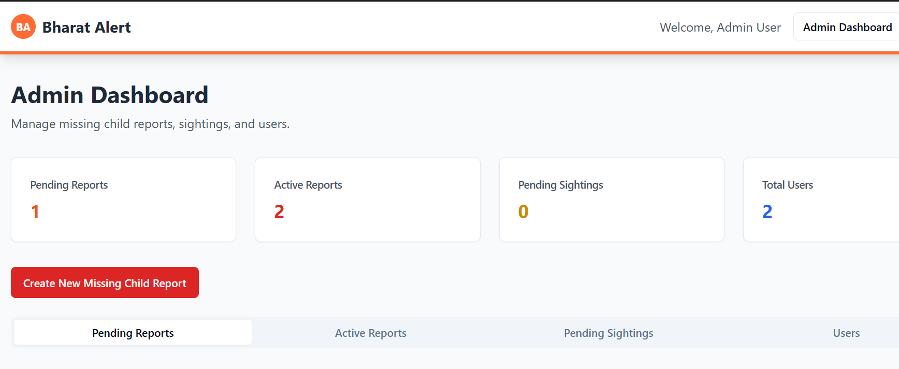
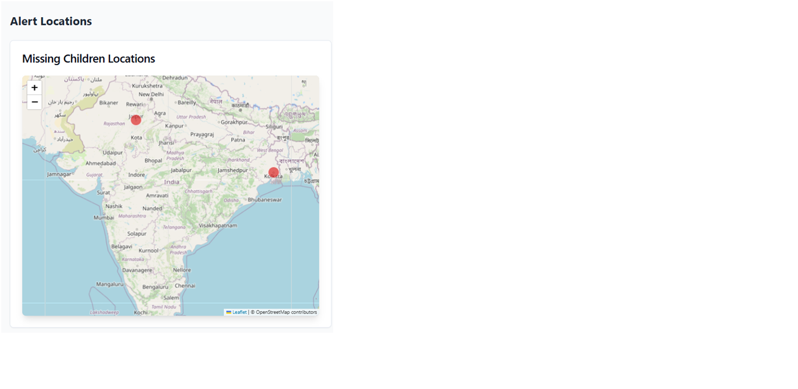
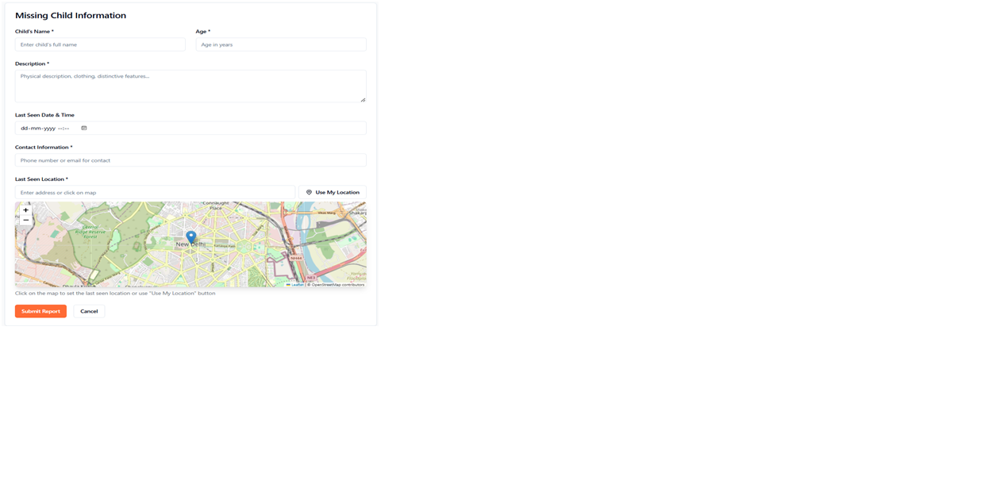

# Bharat Alert – Web-Based Child Abduction Alert System

```
██████╗ ██╗  ██╗ █████╗ ██████╗  █████╗ ████████╗     █████╗ ██╗     ███████╗██████╗ ████████╗
██╔══██╗██║  ██║██╔══██╗██╔══██╗██╔══██╗╚══██╔══╝    ██╔══██╗██║     ██╔════╝██╔══██╗╚══██╔══╝
██████╔╝███████║███████║██████╔╝███████║   ██║       ███████║██║     █████╗  ██████╔╝   ██║   
██╔══██╗██╔══██║██╔══██║██╔══██╗██╔══██║   ██║       ██╔══██║██║     ██╔══╝  ██╔══██╗   ██║   
██████╔╝██║  ██║██║  ██║██║  ██║██║  ██║   ██║       ██║  ██║███████╗███████╗██║  ██║   ██║   
╚═════╝ ╚═╝  ╚═╝╚═╝  ╚═╝╚═╝  ╚═╝╚═╝  ╚═╝   ╚═╝       ╚═╝  ╚═╝╚══════╝╚══════╝╚═╝  ╚═╝   ╚═╝   
                                                                                              
```

## 📝 Description

**Bharat Alert** is a simulation of an Amber Alert–style system for India. It is a fully web-managed alert system allowing users to report missing children, and enabling admins to track, verify, and manage alerts and sightings.


---

## 🌟 Core Features

✅ **Submit Reports:**  
- Child's name, age, gender  
- Last seen location (text + map pin)  
- Date/time, contact info, optional photo  

✅ **Admin Controls:**  
- Approve or reject pending reports  
- View live alerts  
- Mark reports as “Solved”  

✅ **Sighting Reports:**  
- Anyone can submit sightings tied to a missing child report  
- Location + comments are recorded  

✅ **Public Alert Board:**  
- Approved reports displayed with map pins showing last known locations  

---

## 🌐 Pages Overview

| Page | Description |
|------|-------------|
| `/submit-report` | Form to report a missing child |
| `/admin-dashboard` | Admin control panel |
| `/alerts` | Public alert board with live map |
| `/report/:id` | View detailed report and submit sighting |
| `/sighting/:id` | Submit a sighting for a specific report |

---

## 🗺️ Map Integration

- Built with **Leaflet.js + OpenStreetMap**
- Pin last seen/sighting locations
- Drop-a-pin while reporting
- View all sightings per report

---

## 🧪 Tech Stack

- **Frontend:** HTML, CSS, JS (React optional)
- **Map:** Leaflet.js or Google Maps (API key needed)
- **Database:** JSON-based mock database

```json
{
  "pending_reports": [],
  "approved_reports": [],
  "solved_reports": [],
  "sightings": []
}
```

---

## 📸 Screenshots

| User Report Form | Admin Dashboard |
|------------------|------------------|
|  |  |

| Alerts Board | Sighting Report |
|--------------|------------------|
|  |  |


---

## 📧 Test Emails

Appears on login panel...

---

## 🎯 Goal

Simulate a real-world child abduction alert system for India – featuring:

- Full admin control
- Location-based alerting
- Public awareness via an online alert board
- Real-time tracking simulation

---

## 🙌 Contributing

👥 Developed by Sushanth and Tejesh
